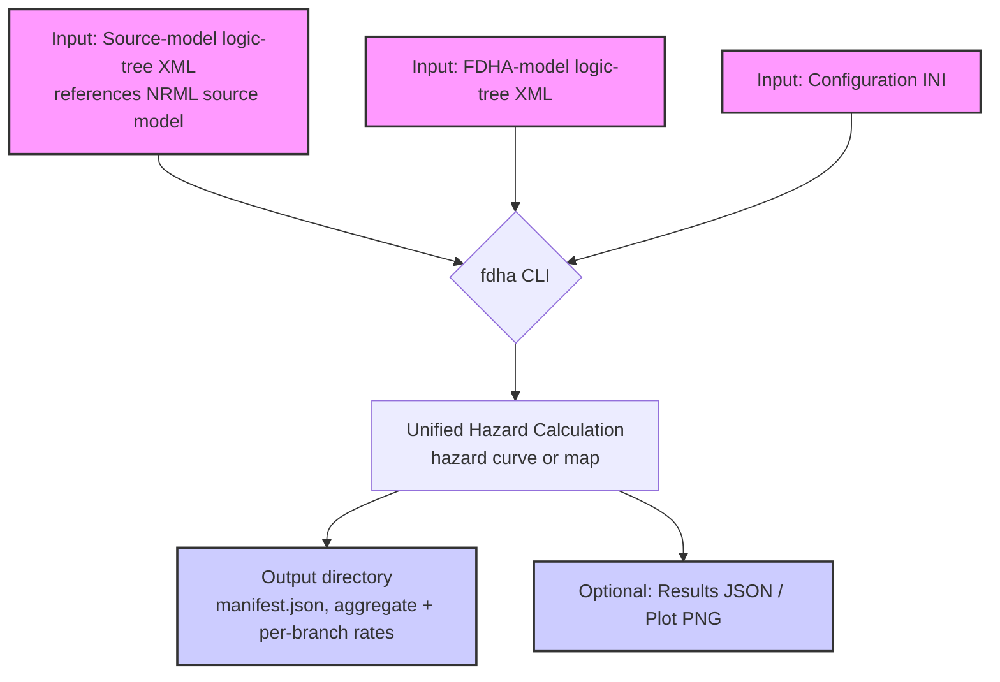

# Overview of the PFDHA Toolkit

Welcome to the User Manual for the Probabilistic Fault Displacement Hazard Analysis (PFDHA) toolkit. This document provides a comprehensive guide to installing the software, understanding its features, preparing inputs, and running calculations.

## What is PFDHA?

The PFDHA toolkit is a command-line application for quantifying the hazards associated with earthquake-induced surface fault rupture and displacement. It allows users to perform probabilistic analyses to understand the likelihood of different levels of fault displacement at specific sites or across a region.

The methodologies and implementation are designed to be transparent, extensible, and compatible with established standards in seismic hazard analysis.

## Core Features

-   **Hazard Curve Calculation**: Compute a hazard curve representing the annual frequency of exceedance for various levels of fault displacement. When multiple model realizations (logic-tree branches) are combined, the calculation produces the weighted mean curve together with a configurable set of fractile curves (default: 5th, 16th, 50th, 84th, and 95th percentiles; see the `[output]` section in the Configuration chapter).
-   **Hazard Map Calculation**: Generate hazard maps that show the spatial distribution of fault displacement hazard across a defined region for a given probability level or return period.
-   **Extensible Model Library**: A modular library of published scientific models for both primary and secondary surface rupture and displacement.
-   **Flexible Configuration**: All aspects of a calculation are controlled through a simple and clear configuration file (INI format).
-   **Standard-based Inputs**: The tool uses the NRML (Natural Hazard Risk Markup Language) XML format for seismic source models, ensuring interoperability with tools like the OpenQuake Engine.

## High-Level Workflow

The general workflow combines three inputs — an INI configuration file, a
source-model logic-tree (NRML XML, which references the seismic source model),
and an FDHA-model logic-tree (NRML XML) — to run a hazard calculation via the
`fdha` command-line interface (CLI).

## How to Use This Manual

This manual is structured to guide you from basic installation to advanced workflows. We recommend starting with the [Installation](01-Installation.md) and [Quick Start](02-QuickStart.md) sections. From there, you can explore the detailed guides:

-   **User Guide**:
    -   [Installation](01-Installation.md): A step-by-step guide to get the PFDHA tool running.
    -   [Quick Start](02-QuickStart.md): A tutorial with a simple, runnable example.
    -   [Inputs](03-Inputs.md): Details on the source model and other required inputs.
    -   [Command-Line Interface](04-CLI.md): A complete reference for all CLI commands.
    -   [Configuration](05-Configuration.md): A detailed guide to the configuration file (INI format).
    -   [Scientific Models](06-Models.md): In-depth explanations of the available models.
    -   [Workflows](07-Workflows.md): End-to-end examples of common analyses.
    -   [Outputs](08-Outputs.md): A guide to understanding the results.
    -   [Aleatory and Epistemic Uncertainty](09-Uncertainty.md): How σ, τ/φ, truncation, and epistemic branches are treated in each registered model.
