# PFDHA Aleatory Uncertainty Validation Dashboard

Generated: 2025-11-27 14:32:11

## Overview

This report validates aleatory uncertainty quantities between the **pfdha** (OpenQuake) 
and **fdhpy** (reference) implementations of fault displacement hazard models.

### Models with Explicit Aleatory Validation

| Model | Tested Quantities | Status |
|-------|-------------------|--------|
| **Kuehn et al. (2024)** | σ_total, μ, σ_mag | ✅ Validated |
| **Lavrentiadis & Abrahamson (2023)** | σ_μ_agg, σ_agg, φ_agg, τ_agg | ✅ Validated |
| **Petersen et al. (2011)** | μ, σ (elliptical & quadratic) | ✅ Validated |

### Models Without Explicit Aleatory Testing

The following models are **not testable for explicit aleatory parameters** because
the pfdha implementation does not expose sigma/mu values through public API methods.
Their aleatory uncertainty is implicitly validated through exceedance probability
tests in `test_simple_reference.py`.

| Model | Reason |
|-------|--------|
| **Youngs et al. (2003)** | μ, σ, α, β computed internally in `get_prob()` |
| **Moss et al. (2024)** | μ, σ, α, β computed internally in `get_prob()` |
| **Chiou et al. (2025)** | σ_prime, σ_mag, σ_xl computed internally in `get_prob()` |

---

## Summary Statistics

**Total test cases:** 99  
**Passed:** 99 (100.0%)  
**Failed:** 0

### Comparison by Model and Quantity

| Model | Quantity | Count | Max Abs Diff | Mean Abs Diff | Max Rel Diff (%) | Mean Rel Diff (%) | Pass Rate |
|-------|----------|-------|--------------|---------------|------------------|-------------------|-----------|
| Kuehn 2024 | mu | 12 | 8.88e-16 | 4.26e-16 | 0.000000 | 0.000000 | 100.0% |
| Kuehn 2024 | sigma_mag | 12 | 1.11e-16 | 2.78e-17 | 0.000000 | 0.000000 | 100.0% |
| Kuehn 2024 | sigma_total | 12 | 1.11e-16 | 1.85e-17 | 0.000000 | 0.000000 | 100.0% |
| Lavrentiadis 2023 | phi_agg | 6 | 0.00e+00 | 0.00e+00 | 0.000000 | 0.000000 | 100.0% |
| Lavrentiadis 2023 | sig_agg | 6 | 0.00e+00 | 0.00e+00 | 0.000000 | 0.000000 | 100.0% |
| Lavrentiadis 2023 | sigma_mu_agg | 9 | 0.00e+00 | 0.00e+00 | 0.000000 | 0.000000 | 100.0% |
| Lavrentiadis 2023 | tau_agg | 6 | 0.00e+00 | 0.00e+00 | 0.000000 | 0.000000 | 100.0% |
| Petersen 2011 | mu | 18 | 0.00e+00 | 0.00e+00 | 0.000000 | 0.000000 | 100.0% |
| Petersen 2011 | sigma | 18 | 0.00e+00 | 0.00e+00 | 0.000000 | 0.000000 | 100.0% |

---

## Per-Model Results

### Kuehn 2024

- **Cases tested:** 36
- **All within tolerance:** Yes ✅
- **Max relative error:** 0.000000%

#### sigma_total

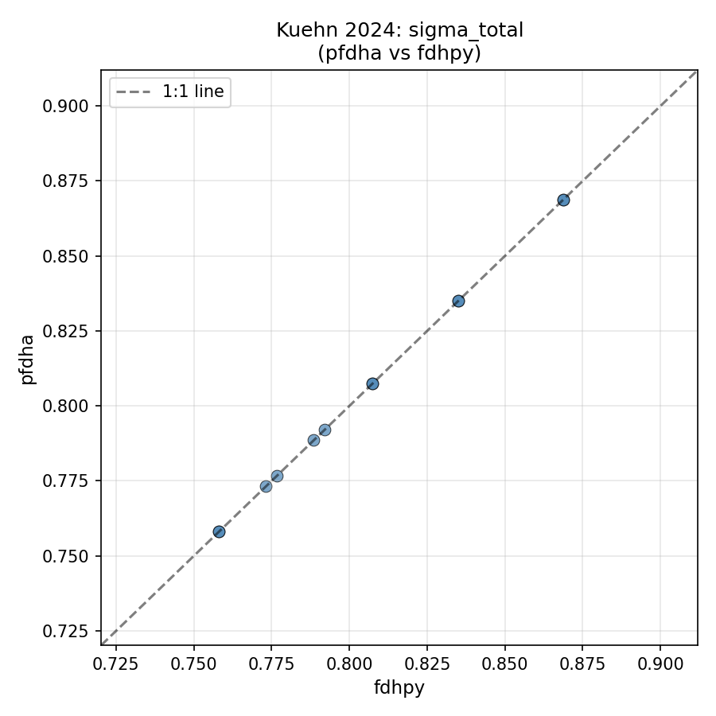
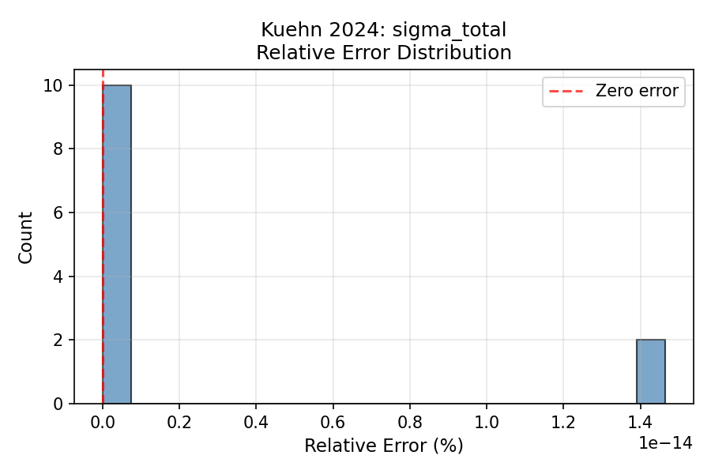

#### mu

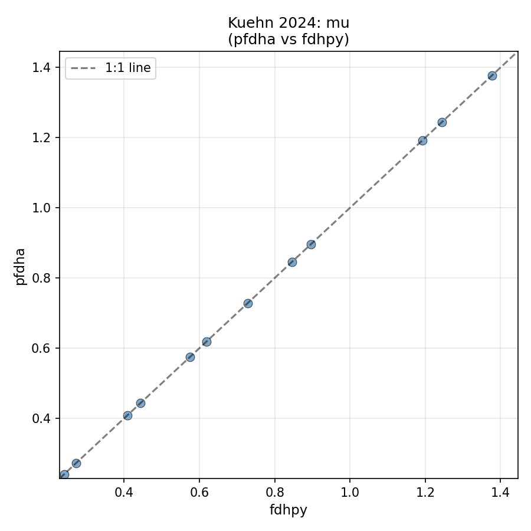
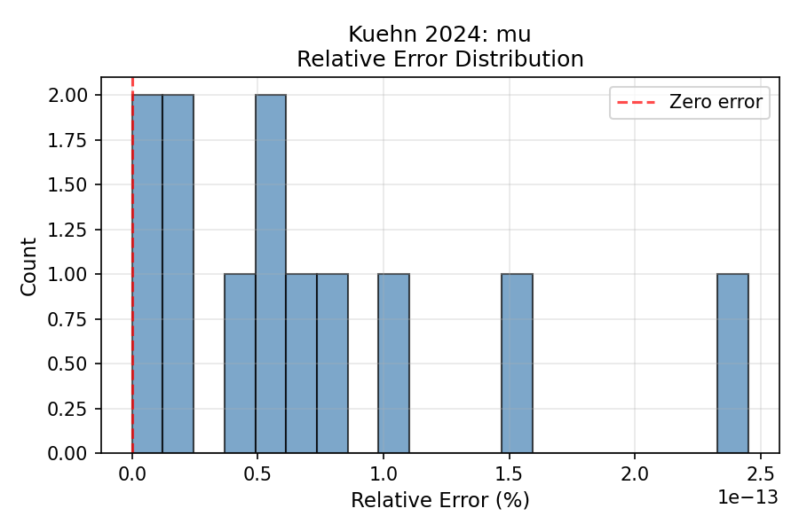

#### sigma_mag

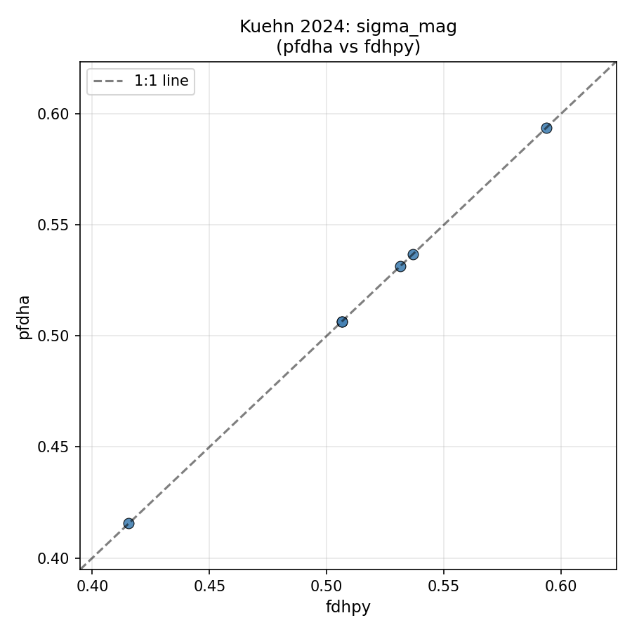
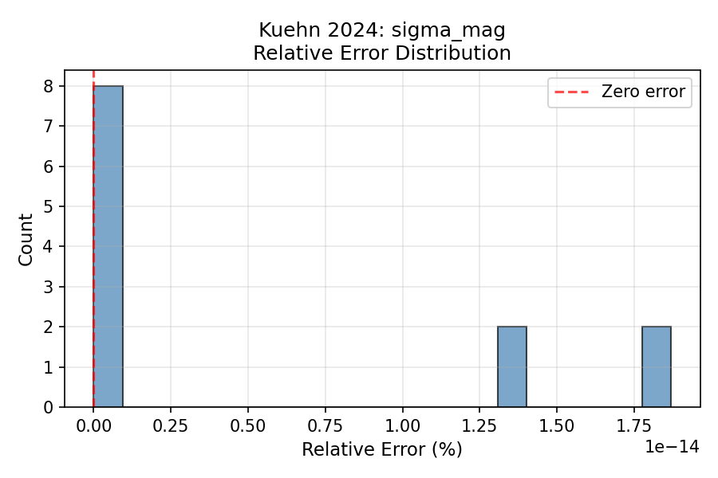

### Lavrentiadis 2023

- **Cases tested:** 27
- **All within tolerance:** Yes ✅
- **Max relative error:** 0.000000%

#### sigma_mu_agg

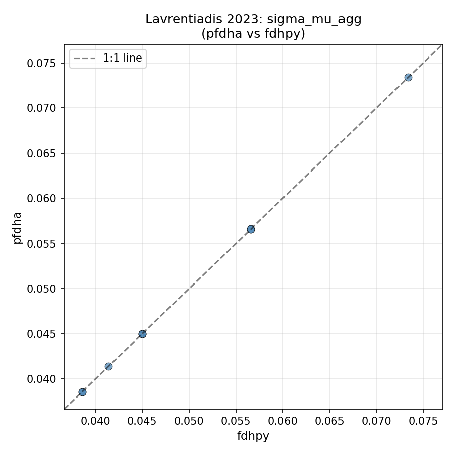
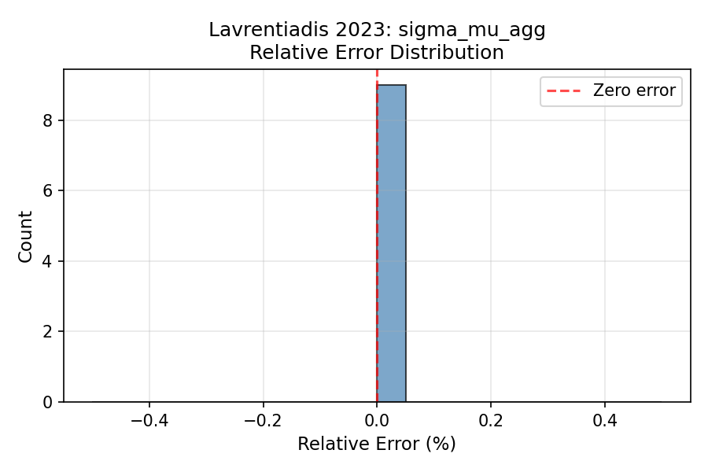

#### sig_agg

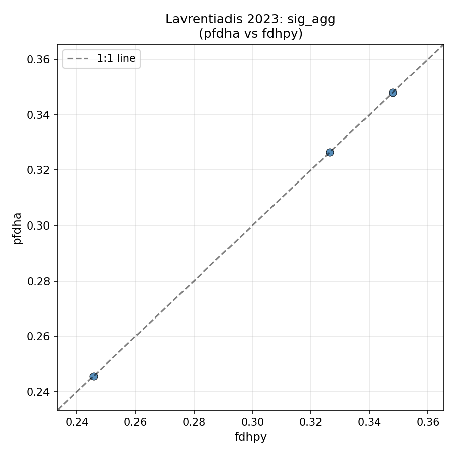
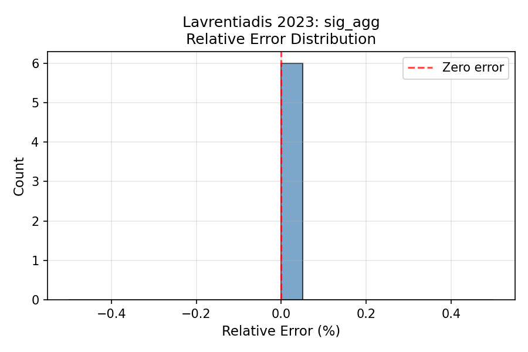

### Petersen 2011

- **Cases tested:** 36
- **All within tolerance:** Yes ✅
- **Max relative error:** 0.000000%

#### mu

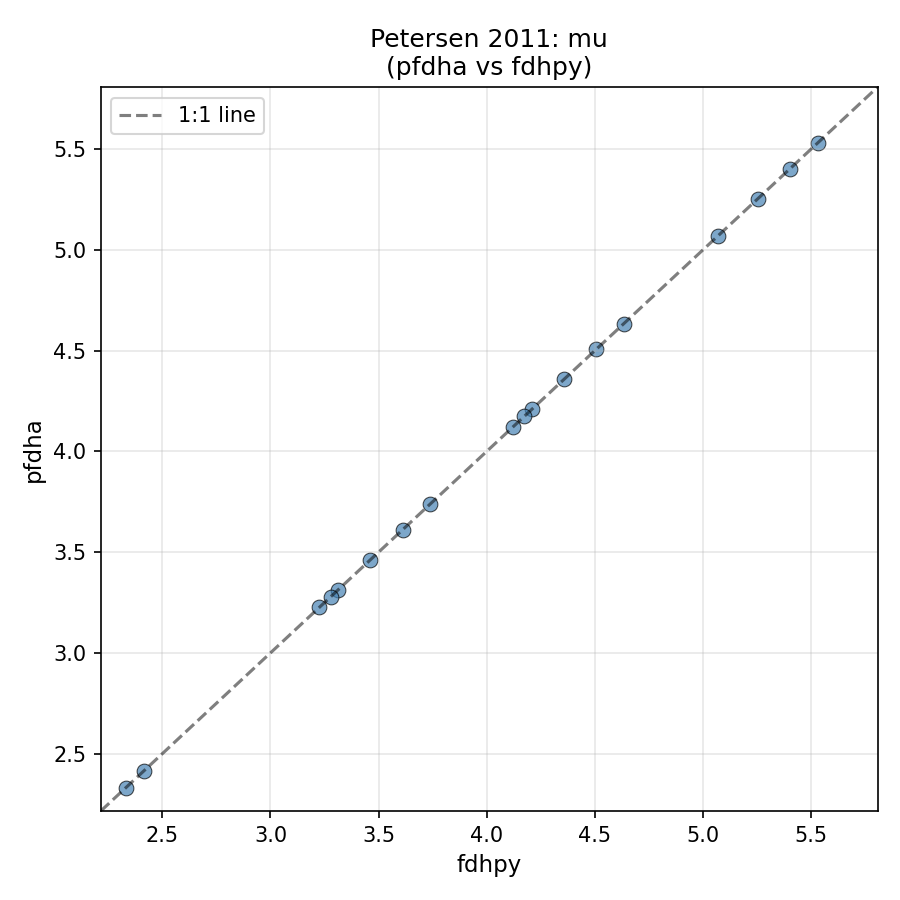
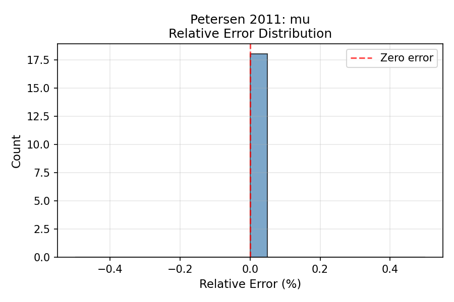

#### sigma

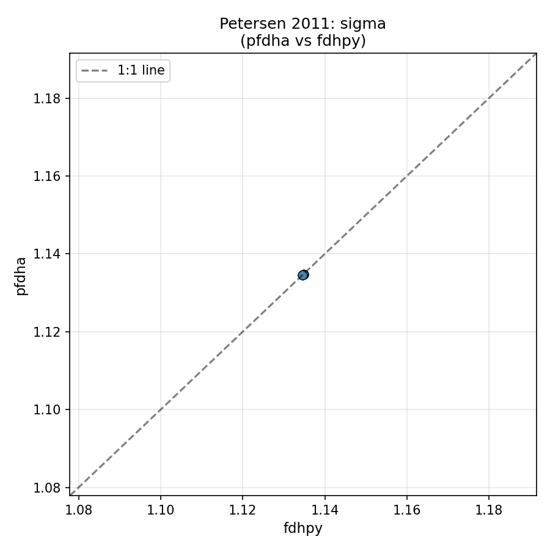
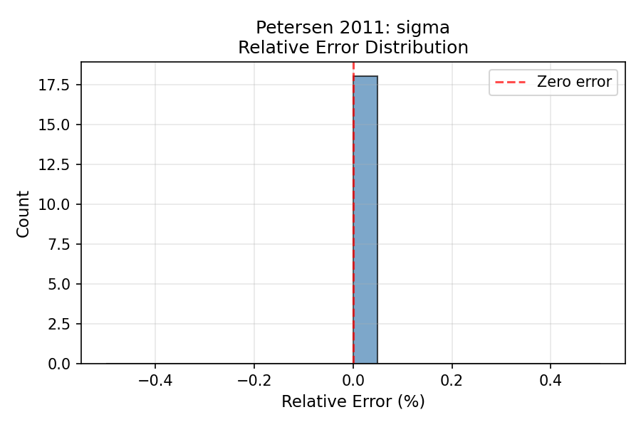

