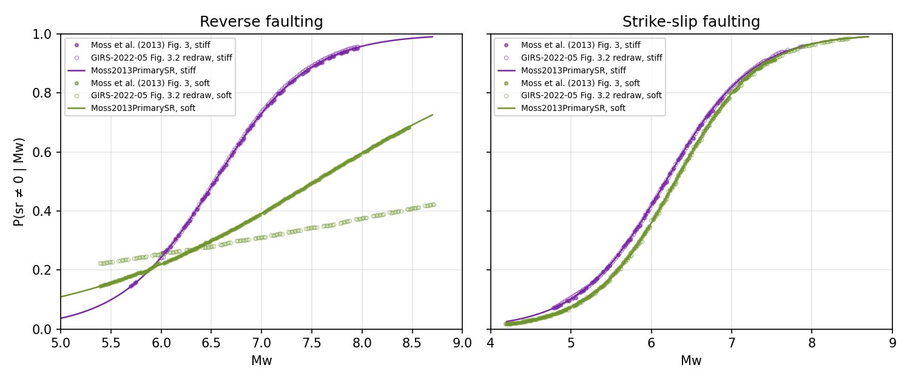

# Moss et al. (2013) - published-curve benchmark

Validates `Moss2013PrimarySR` against the four P(sr | Mw) curves of Moss et
al. (2013) Figure 3, and records how the redraw of those curves in
GIRS-2022-05 Figure 3.2 relates to them. Sources in
[REFERENCE.md](REFERENCE.md).

Run: `pytest openquake/fdha/test/benchmark/moss_2013 -q`

## Reference data

- `digitize_moss2013_fig3.py`: the paper's Figure 3 (greyscale JPEG,
  150 ppi) -> `reference/moss2013_fig3.csv`. Axes calibrated on the major
  gridlines (worst residual 0.25 % in P, 0.007 in Mw); the dashed (stiff)
  and solid (soft) curves are told apart by ink darkness.
- `digitize_girs_fig3_2.py`: GIRS-2022-05 Figure 3.2 (colour raster,
  222 ppi) -> `reference/girs_fig3_2.csv` (worst residual 0.23 %, 0.006 Mw).

The PDFs are not committed; the CSVs are. `plot_comparison.py` draws
`Figures/moss2013_fig3_comparison.png`.

## Agreement with Moss et al. (2013) Figure 3

| Curve | Points | Median / max. abs. difference | Refit of the plotted curve | Legend (= library) |
|---|---:|---|---|---|
| Reverse, stiff | 72 | 0.21 / 0.79 points | z = -13.80 + 2.113 Mw | z = -13.9745 + 2.1395 Mw |
| Reverse, soft | 186 | 0.08 / 0.82 points | z = -6.23 + 0.828 Mw | z = -6.2548 + 0.8308 Mw |
| Strike-slip, stiff | 60 | 0.12 / 0.73 points | z = -11.39 + 1.843 Mw | z = -11.4071 + 1.8465 Mw |
| Strike-slip, soft | 157 | 0.13 / 0.90 points | z = -12.27 + 1.950 Mw | z = -12.2908 + 1.9520 Mw |

## Erratum in the GIRS-2022-05 redraw

Three of the four redrawn curves agree with the paper within 1.1 points.
The reverse soft-soil curve does not: it is the logistic
z = -2.78 + 0.284 Mw (22 % at Mw 5.4 to 42 % at Mw 8.7), whereas the
original figure, its legend, the report's own Eq. 3.5 and its Appendix C
MATLAB code all give z = -6.2548 + 0.8308 Mw (15 % to 73 %). The library
follows the paper. `test_girs_fig3_2.py` keeps that comparison as a strict
`xfail` so the erratum stays on record.
